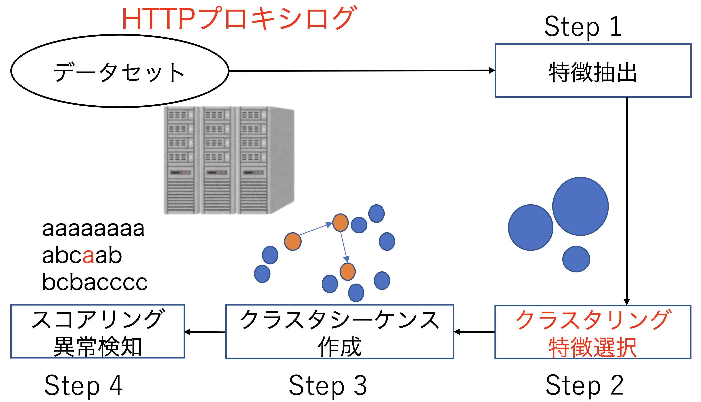

# Harmoware-SEC
## Anomaly Traffic Detection using Using Unsupervised Machine Learning

In this project, we are developing an unsupervised learning method for detecting anomaly communication in our network, focusing on the transitions between clusters of communication.
To defend against advanced cybersecurity threats, a huge amount of logs and alerts from security devices must be efficiently analyzed.
However, it is impractical to prepare a sufficient amount of labeled train data in real time.
We, therefore, focused on unsupervised methods to detect anomaly traffic.
In particular, we proposed an anomaly detection method and its source code for features extracted from web (http) proxy logs.
We implemented the three components of feature selection, clustering, and anomaly detection.
We first extract and select the features from proxy logs, and then apply various clustering methods for the feature vectors.
After the clustering, we make sequence data of transitions between clusters for communication and analyze its singularity as sequence data. 

Our overall detection system is shown in the following picture.

## Source code

- feature_selection
    - We select and extract good features by using FSSEM (Feature Subset Selection using Expectation-Maximization (EM) clustering)
- clustering_proxy_log
    - In addition to the clustering methods, this includes the methods to make formatted log data for raw traffic data 
- anomaly_detection_for_cluster_sequence
    - Compute similarities of sequence data and detect anomalies

We note that this repository has no dataset that we used for the experiment.
We used D3M (Drive-by-Download Data by Marionette) dataset provided by [Anti Malware Engineering Workshop (MWS)](https://www.iwsec.org/mws/) as malicious traffic data.

## Paper

[Our work](scis2018.pdf) has been presented at 2018 Symposium on Cryptography and Information Security (SCIS2018) in Japanese.

- M. Ishii, Z. Inomata, C. Oyunbileg, T. Kyouyama, K. Kuroda, A. Sato, M. Sugaya, K. Tanaka, R. Chiba, T. Nishiwaki, Y. Hashimoto, S. Hirono, S. Matsuura, K. Mori: "Evaluation of Anomaly Detection Algorithms on Cluster Sequence of Proxy Server Logs（プロキシログのクラスタ間遷移に着目した異常検知手法の評価）",
In Proceedings of Symposium on Cryptography and Information Security (SCIS) 2018, Copyright(C)2018 The Institute of Electronics, Information and Communication Engineers, 2018.

## License
This project is licensed under the [Apache License 2.0](LICENSE).
